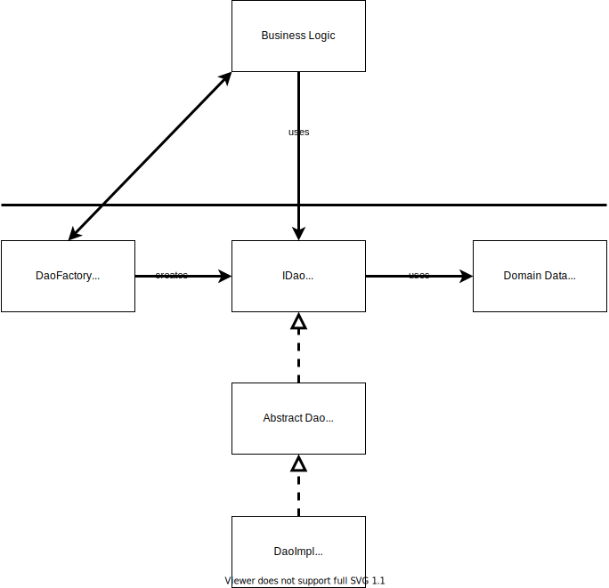
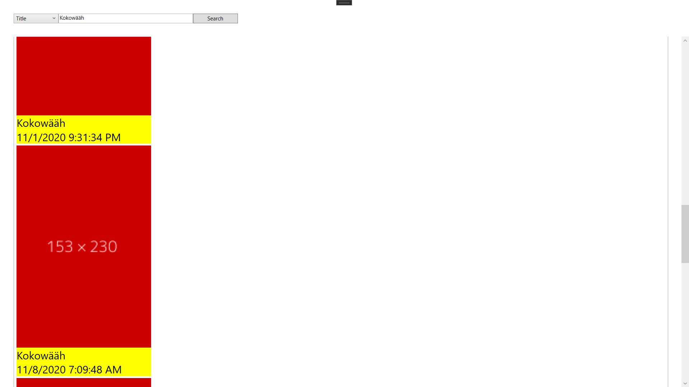
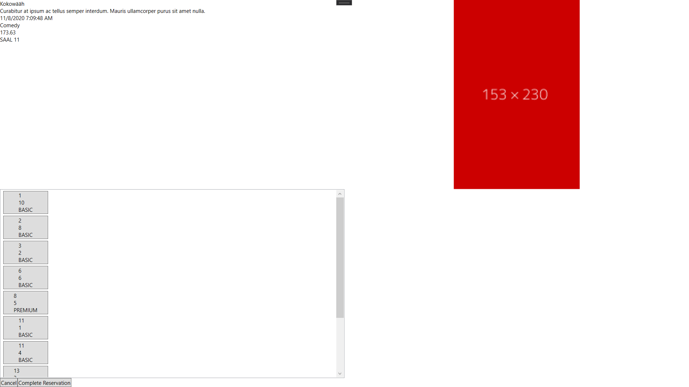

# Apollo
An all-in-one software solution for cinemas.

## Architecture
### Solution Structure
**`Apollo.Core.Interface`**

All important interfaces provided by `Apollo.Core` that are used by other system components.

**`Apollo.Core.Test`**

The testing project for `Apollo.Core`. It tests all the important components of `Apollo.Core` such as the data access objects and the service classes.

**`Apollo.Core`**

The main component of the backend of Apollo containing the business logic of the applications. Its functionality is provided to the other components by the interfaces defined in `Apollo.Core.Interface`.

**`Apollo.Domain`**

This projekt contains the domain entities of the backend. They are similar to the database tables and are often used as data transfer objects. These are the fundamntal data types of `Apollo.Terminal` and `Apollo.Api`.

**`Apollo.Terminal`**

A desktop application developed using the Windows Presentation Foundation. Its purpose is to buy ticket on-site in the cinema in an intuitive, fast and automated way.

**`Apollo.Web`**

A web application using React and TypeScript. It shows the cinema's program and has an admin section to administrate the entire content.

**`Apollo.Api`**

The REST service used by `Apollo.Web` in order to receive all necessary data. Developed using ASP.NET Core.

### Domain Model

The application contains six main entities. Each entity is being reflected in the database and in the domain classes.
The main entity is Movie. This entity contains all necessary data that needs to be stored related to a movie:
* **title**: unique specifier of the movie title
* **description**: short description of the movie in a few sentences
* **genre**: one or more genres in plain text
* **length**: movie length in minutes
* **actors**: main actors of the movie in plain text
* **imageURL**: link to the cover photo of the movie
* **trailerURL**: link to the trailer video of the movie

The entity that is directly connected to Movie is Show. A show represents a specific movie being showed in the cinema:
* **startsAt**: date and time when the show starts
In order to identify a show uniquely, it needs to be connected with a specific movie and a specific hall in the cinema. In theory, one movie could be shown at the same time in two different cinema halls.

A CinemaHall specifies a specific hall in the cinema where the movies are shown:
* **name**: a name that identifies the hall uniquely within a cinema
* **rowAmount**: number of rows in the hall
* **seatAmount**: number of seats per row

A Reservation hold all information needed to manage the reservations that can be ordered via the clients:
* **id**: an unique identifier
* **maxSeats**: the maxium amount of seats that can be reserved in this reservation
Each reservation has a connection to one or more seats and refers to a specific show

A seat comprises data of a specific seat for each show. For every movie that is shown, there is an extra seat entity:
* **seatNumber**: the number of the seat within a row
* **rowNumber**: the number of the row within a cinema hall

The last entity SeatCategory categoriezes each seat into a specific price category:
* **name**: the unique name of the seat category
* **price**: the price of a movie at this specific seat

### Structure of the Data Access Layer

The data access layer implements the DAO pattern which stands for Data Access Object. For each entity there is one central interface which is the access point for the business logic.
These interfaces use the domain classes that are implemented based on the domain model.
The interfaces are implemented by abstract classes in ADO.NET, which is an access technology to a memory system.
The abstract classes are finally overwritten by database specific classes. Apollo uses the Microsoft SQL Server Database Management System. The database for testing is an in-memory LocalDB which is also part of Microsoft SQL Server.
The database connection is created by factory classes using the factory pattern. Before the Business Logic can use the DAO interfaces, it needs to generate a data connection first using the factory classes.

## User Manual
### `Apollo.Terminal`
The terminal applications starts with a screen saver which shows the latest shows playing in the Apollo cinemas. In order to start ordering a ticket, the user needs to click anywhere.

After leaving the screen saver mode, shows that are playing today are displayed on the screen. Therefore, the user has a good overview what the upcoming shows are. Each show displays the movie image, the movie title and the time ob beginning.

If the user does not want to book a ticket for this exact date, he has the opportunity to search for a specific movie title or a specific genre in the search bar at the top. After clicking on the search button, shows that fit the search well be displayed underneath.

When clicking on a show, more detailed information about the show will be displayed, such as the cinema hall, cast, length and the seat layout. By clicking on a seat, it will be selected for the ticket registration.

Each seat is in a specific price category. When clicking the approval button, a window will open that prompts the user to enter his credit card information.

If the payment was successful, the ticket will be generated.

